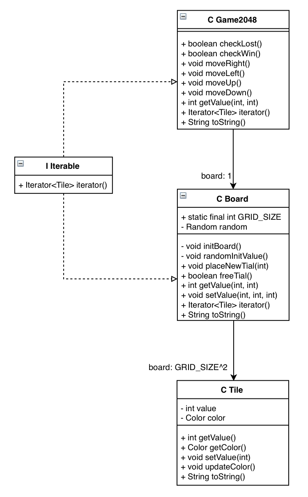

# Prosjekt - 2048

## Del 1: Beskrivelse av appen
Appen jeg har lagd er spillet 2048. Dette er et spill som spilles på et 4x4-brett som stadig fylles med nye verdier (2 eller 4). Ved hjelp av piltastene kan spilleren flytte verdiene til ønsket retning, og så vil like verdier smeltes sammen. Dersom man  får en rute med verdien 2048 har man vunnet, men dersom man når et punkt der man ikke kan flytte noe mer på brettet og man enda ikke har en rute med verdi 2048, har man tapt. 

Prosjektet følger det såkalte Model-View-Controller-prinsippet, og består dermed av tre deler. Først har vi brukergrensesnittet (view) som er definert i FXML-fila '2048.fxml'. Den mest sentrale delen av prosjektet, altså det som utgjør Model, består av en rekke interagerende klasser, nemlig 'Tile.java', 'Board.java', 'BoardIterator.java' og 'Game2048.java'. Sammen utgjør disse klassene i realiteten selve spillet med alt dets logikk. Til slutt har vi Controlleren, som i dette prosjektet er filen 'AppController.java', som binder Model og View sammen.

## Del 2: Diagram
Under finner du et klassediagram som viser sammenhengen med noen av de viktigste klassene innenfor Model-delen av appen:

Her har jeg da valgt å ta med de klassene som utgjør selve spillet med dets logikk. Teknisk sett er også 'BoardIterator'-klassen også en del av Model, men siden den ikke ville hatt noen direkte koblinger til noen av de andre klassene valgte jeg å ikke inkludere det i dette klassediagrammet.

## Del 3: Spørsmål

### 1.
Store deler av pensum dekkes i dette prosjektet. Åpenbart dekkes det meste om grunnleggende prosedyreorientert programmering, altså datatyper, variabler og lignende, da dette er nødvendig for å implementere logikken i metoder som for eksempel moveUp() i 'Game2048'-klassen. 

Videre dekker prosjektet naturligvis også mye innenfor grunnleggende objektorientert programmering, gjennom bruken av klasser, felt, metoder, konstruktører og lignende, samt opprettelsen av objekter og interaksjon meloom disse, som for eksempel i 'AppController'-klassen. Innkapsling og unntakshåndtering er også blitt inkludert. Innkapsling er da oppnådd gjennom synlighetsmodifikatorer og tilgangsmetoder utrustet med validering, mens unntakshåndteringen blant annet har handlet om å ta nytte av ulike Exceptions. Det var også et krav om testing, som da er møtt med samtlige JUnit-tester for klassene, og delen i pensum om diagrammer blir dekket i del 2 av denne dokumentasjonen.

Både grensesnitt og arv er også brukt. 'Board.java' og 'Game2048.java' implementerer nemlig Iterable, slik at jeg kan bruke "BoardIterator'-klassen til å lettere iterere gjennom brettet. Arv er ikke brukt i like stor grad, men var nødvendig i 'App'-klassen, som måtte extende Application.

Når det gjelder Java-teknikker, er det mye her som på på et naturlig vis blir en del av prosjektet. For eksempel er det da snakk om synlighetsmodifikatorene som brukes for feltene, casting i 'AppController'-klassen, Collection-rammeverket for lister og Exceptions for å utløse unntak. Jeg fikk også tatt i bruk funksjonelle grensesnitt og stream ("objekt-strømmer") i toString()-metoden til 'Board'-klassen, mens jeg fikk utnyttet IO-streams i 'FileManager'-klassen som ordnet filhåndteringen.

Jeg fikk samtidig tatt i bruk delegeringsteknikken. Et eksempel på dette fra prosjektet er getValue()-metoden i 'Game2048.java'. Her delegeres nemlig oppgaven direkte videre til 'Board'-objektet som er deklarert i klassens eneste felt. Dette var en nyttig ordning for systemet.

Til slutt dekkes også delen om JavaFX og FXML, gjennom '2048.fxml' og 'AppController.java'. Mens '2048.fxml' inneholder brukergrensesnittet, sørger 'AppController.java' for å koble dette opp til modellen vi finner i de andre klassene. 

### 2.
Selv om store deler av pensum er dekket i prosjektet, er det også noen deler som ikke er inkludert, da det ikke falt seg naturlig slik jeg valgte å implementere prosjektet. Et eksempel er observatør-observert-teknikken. Nå skal det sies at det gjennom 'Appkontroller'-klassen er implementert en samhandling mellom brukergrensesnittet og modellen som kan minne om teknikken, men teknikken er likevel ikke brukt fullt ut slik den vanligvis ville vært. Dette kunne man nok imidlertid ha fått til, ved å endre litt på oppsettet i 'AppController'-klassen og 'Game2048'-klassen.

Jeg brukte heller ikke Comparable eller Comparator til sortering, da jeg ikke hadde noe jeg trengte å sortere. Muligens kunne man brukt det til å sammenligne verdier på brettet. Wrapper-klasser ble heller ikke brukt, da jeg ikke trengte det. Brettet fylte jeg nemlig med 'Tile'-objekter istedenfor tall. Her kunne jeg nok fylt brettet med tall, slik at jeg måtte fylt listen med 'Integer'-objekter og brukt Wrapper-klassen 'Integer', men jeg følte min løsning fungertte bedre.

### 3.
Prosjektet følger det såkalte Model-View-Controller-prinsippet, og består dermed av tre deler. Først har vi brukergrensesnittet (view) som er definert i FXML-fila '2048.fxml'. Brukergrensesnittet er relativt simpelt og består av en Label for tittelen, en GridPane for brettet, tre knapper for lesing og skriving til fil, samt starting av nytt spill, og et usynlig tekstfelt.

Den mest sentrale delen av prosjektet, altså det som utgjør Model, består av en rekke interagerende klasser: 'Tile.java', 'Board.java', 'BoardIterator.java' og 'Game2048.java'. Sammen utgjør disse logikken til spillet, og kan i seg selv fungere som et spill. 

Til slutt har vi Controlleren, som her er filen 'AppController.java'. Denne binder Model og View sammen. Kontroller-klassen inneholder minimalt med tilstand, samt minimalt med egen logikk. I realiteten benyttes klassen kun til å oppdatere brukergrensesnittet om hva som har skjedd i modellen, og motsatt. Dermed er det fortsatt modellen som bærer på all logikken, men så har man 'AppController'-klassen til å binde dette opp mot brukergrensesnittet.

På denne måten følger appen Model-View-Controller-prinsippet.

### 4.
Når det gjelder testing av appen, er dette noe som har blitt gjort veldig grundig. Jeg har laget egne test-klasser for alle klassene i modellen, og innenfor disse test-klassene har jeg laget egne enhetstester for hver metode, slik at jeg er sikker på at de fungerer som de skal. Jeg valgte å gjøre det såpass grundig, da jeg opplevde det som viktig å kunne være så sikker som mulig på at koden oppfører seg som den skal. En liten feil kan nemlig skape store problemer for helheten. Det å lage en rekke JUnit-tester var jo også et av kravene for prosjektet, så derfor var det viktig å få det gjort.